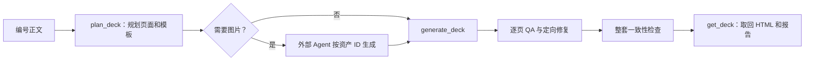

# PPT Generator MCP

把已经分页的中文标书、技术方案或汇报正文，稳定转换成经过逐页 QA 的 A4 横向 HTML 展示页。

它会理解每页内容、选择兼容模板、提出图片需求、接收 Agent 生成的图片，并在真实 Chromium 中检查溢出、字号、碰撞、对比度、图片和事实覆盖。最终交付是可独立打开的自包含 `final.html`，不要求生成 `.pptx`。

- 第一次使用或不熟悉技术：[完整非技术用户指南](docs/user-guide.md)
- 需要了解算法、数据结构、安全和扩展方式：[架构与实现原理](docs/architecture.md)
- 需要维护现有模板：[green-infographic 模板说明](templates/green-infographic/README.md)

## 5 分钟上手

### 路径 A：已有支持 MCP 的 Agent

如果 Agent 已经连接 `ppt-generator`，准备好编号正文，复制下面的提示词即可：

```text
请使用 ppt-generator MCP，把下面的编号正文生成正式标书风格的 HTML 展示页。

1. 校验 <page N> 和 pageNumbers，不要自动分页。
2. 调用 plan_deck，documentType=bid，templateDiversity=balanced。
3. 保留原文事实、数字、日期、范围、否定和责任关系。
4. 如果返回 assets，只按原资产 ID 和 prompt 生成图片；没有图片 API 时使用当前 Agent 的图片生成能力。
5. 调用 generate_deck；needs_assets 时补齐素材并复用同一个 requestId。
6. 逐页检查 QA 和整套 consistency。只有 deck 和每页均为 delivered 才交付。
7. 使用 get_deck 取回每页 final.html、quality.json 和整套 consistency.json。

正文：
[在这里粘贴完整编号正文]
```

详细的 Agent 提示词、验收表和常见问题见[非技术用户指南](docs/user-guide.md#路径-a已有支持-mcp-的-agent)。

### 路径 B：从零安装和启动

要求 Node.js 22 或更高版本。首次安装：

```bash
git clone https://github.com/SUSTechWLA/ppt-generator-mcp.git
cd ppt-generator-mcp
npm install
npx playwright install chromium
npm run check
```

把下面配置加入支持 stdio MCP 的 Agent 或客户端，并将 `cwd` 改为项目的真实绝对路径：

```json
{
  "mcpServers": {
    "ppt-generator": {
      "command": "node",
      "args": ["dist/src/server.js"],
      "cwd": "/您的绝对路径/ppt-generator-mcp"
    }
  }
}
```

保存后重启客户端。Agent 能看到 `plan_deck`、`generate_deck` 和 `get_deck`，即表示连接成功。项目也提供了可直接调整的 [.mcp.json](.mcp.json)。完整安装排查见[从零安装说明](docs/user-guide.md#路径-b从零安装和启动)。

## 正文必须长什么样

上游必须先完成分页。每个 `<page N>` 独占一行，页码严格递增；每页至少有一个标签化标题，随后是 `正文：` 和实际内容。

```text
<page 59>
一级标题：第一分节：优势与有利条件分析
二级标题：2.1 项目需求深度理解
三级标题：2.1.1 项目背景与采购需求解读
正文：
项目服务覆盖三个业务区域，要求在合同生效后30日内完成首轮建档。
项目团队须建立7×24小时响应机制，并按月提交质量分析报告。

<page 60>
一级标题：第一分节：优势与有利条件分析
二级标题：2.2 服务方案
三级标题：2.2.1 实施路径
正文：
实施过程分为启动准备、全面执行、持续优化三个阶段。
```

调用 `plan_deck` 时，`pageNumbers` 必须是 `[59, 60]`。59、60 只是上游编号示例，不参与模板特判；高层 workflow 不猜页码，也不自动重新分页。

正文中的 `；；`、`；。` 等重复或冲突标点会统一规范化，但数字、比例、日期、范围、否定和责任关系仍作为来源证据保留。格式规则和错误示例见[准备正文](docs/user-guide.md#3-正文必须怎样准备)。

## 推荐 workflow



1. `plan_deck` 固化正文事实、页面内容、模板选择和图片提示词，返回 `deckPlanId`。
2. 若返回 `assets`，调用方只按原 ID 和 prompt 生成图片，并转换为 PNG、JPEG 或 WebP data URL（不接受 SVG：其内部脚本对校验层不透明）。
3. `generate_deck` 按不可变计划注入素材、生成页面，并独立执行 Chromium QA。
4. 返回 `needs_assets` 时补齐 `missingAssetIds`，复用同一个生成 `requestId` 继续。
5. 只有整套 `status=delivered` 且每页均为 `delivered` 才能正式交付。
6. `get_deck` 按返回的 UUID 读取每页 `final.html`、`quality.json` 和整套 `consistency.json`。含内嵌图片的 `final.html` 通常超过公共文本上限，`get_deck` 会返回 `html_unavailable` 并给出相对运行根目录的路径（如 `<runId>/final.html`），本地 Agent 直接按该路径读取即可。

规划示例：

```json
{
  "sourceText": "<page 59>\n一级标题：第一分节\n二级标题：2.1 服务理解\n三级标题：2.1.1 采购需求解读\n正文：\n这里是已经分页的事实正文。",
  "pageNumbers": [59],
  "documentType": "bid",
  "templateDiversity": "balanced",
  "audience": "招标评审专家与项目业主",
  "quality": { "minScore": 90, "maxAttempts": 3 },
  "requestId": "proposal-plan-20260731"
}
```

生成示例：

```json
{
  "deckPlanId": "plan_deck 返回的 UUID",
  "externalAssets": [
    { "id": "p59-img-001", "dataUrl": "data:image/png;base64,真实图片内容" }
  ],
  "requestId": "proposal-run-20260731"
}
```

没有图片需求时，`externalAssets` 传空数组。MCP 不会在规划阶段偷偷调用图片服务；没有图片 API 时，可由 Agent 使用自身图片能力生成后注入。完整操作过程见[一次完整生产流程](docs/user-guide.md#4-一次完整生产流程)。

## 运行结果在哪里

整套状态：

| 状态 | 含义 | 是否可交付 |
|---|---|---|
| `needs_assets` | 仍缺计划要求的图片，可以恢复 | 否 |
| `running` | 正在生成或恢复 | 否 |
| `partial` | 有失败页或一致性问题 | 否 |
| `delivered` | 所有页面和整套检查通过 | 是 |
| `failed` | 没有形成可继续的安全结果 | 否 |

每个页面都有独立 `runId`。通过 `get_deck` 读取该页的 `final.html`、`quality.json` 和 `manifest.json`；通过整套 `deckRunId` 读取 manifest 和 `consistency.json`。

本机默认目录是 `output/runs`：

```text
output/runs/
├── <page-runId>/
│   ├── final.html
│   ├── final.png
│   ├── quality.json
│   ├── manifest.json
│   └── assets/
├── decks/
│   ├── plans/<deckPlanId>/plan.json
│   └── runs/<deckRunId>/
│       ├── manifest.json
│       └── consistency.json
└── template-knowledge/
```

高层 MCP 接口只按 UUID 和白名单产物名读取，不接受任意路径。状态解释和验收方式见[如何判断是否可以交付](docs/user-guide.md#6-如何判断是否可以交付)。

## 它怎样选择模板

先做硬门禁，再考虑多样性：

1. 每个模板独立证明能够容纳本页事实、语义角色、文字容量、图片数量、最低字号和文档类型；
2. 失败候选直接淘汰；
3. 只有接近本页最佳质量的成功候选，才参与整套组合选择；
4. 整套选择奖励不同版式、惩罚连续重复，同时保持确定性和可复现。

`templateDiversity` 提供四种模式：

| 模式 | 建议用途 |
|---|---|
| `off` | 每页只选自己的局部质量赢家 |
| `conservative` | 极克制地打破近似平局 |
| `balanced` | 默认推荐；在窄质量范围内兼顾质量和整套节奏 |
| `expressive` | 更强调视觉变化，但仍不放松硬门禁 |

如果某页只有一个完整成功候选，重复模板就是正确结果。这个选择器不是强化学习：没有训练、探索或在线奖励更新；相同正文、模板目录和参数会得到相同结果。更详细的选择顺序和质量带见[架构文档](docs/architecture.md#43-局部质量排序与整套序列选择)。

## 核心能力

- 严格分页协议，不猜页码，不自动切页；
- 中文重复和冲突标点规范化；
- 事实、数字、日期、范围、否定与责任关系覆盖；
- 卡片与信息图组件使用来源正文派生的真实主题词，而不是通用角色标签；
- 高密度双栏文字版式与图文版式由模板多样性自动交替，整套页面版式不单调；
- 通用模板能力匹配，不针对页码、正文或模板名写特例；
- 整套页面的确定性模板多样性选择；
- 稳定图片 ID 和外部素材注入；
- 每页独立 Chromium QA，最多三轮定向修复；
- 中文页面硬门禁：系统无可用中文字体时拒绝交付（避免缺字方框通过 QA）；
- 整套一致性检查、幂等恢复和脱敏产物读取；
- 从参考 HTML、截图或通用蓝图沉淀模板知识；
- 文本、图片和复核 Provider 均为可选。

基本原理的非技术解释见[为什么结果更稳定](docs/user-guide.md#7-基本原理为什么结果更稳定)，完整实现见[架构与实现原理](docs/architecture.md)。

## 主要 MCP 工具

普通多页生产只需要下面六个高层工具：

| 工具 | 用途 |
|---|---|
| `plan_deck` | 编号正文 → 不可变页面计划、模板证据和图片提示词 |
| `generate_deck` | 外部素材 → 页面生成、逐页 QA 和整套一致性检查 |
| `get_deck` | 按 UUID 读取计划、manifest 和白名单产物 |
| `inspect_template` | 只读分析参考 HTML 的通用布局知识 |
| `create_template_from_reference` | 从 HTML、截图或 blueprint 编译并 QA 模板知识 |
| `list_template_knowledge` | 查看已批准的模板知识和 QA 证据 |

`plan_slide`、`generate_slide`、`get_run`、`generate_image` 和原子模板工具用于兼容、诊断或受控开发。部分高级工具可接收物理路径、远程地址、输出目录或调用方 provider 配置，属于 trusted-local surface，不应直接开放给不可信 Agent。完整边界见[安全设计](docs/architecture.md#11-安全设计)。

## 模板知识 workflow

模板学习提取的是网格、层级、色板、间距、组件和视觉比例，不复制参考页正文、Logo、水印、品牌或整页截图。

1. 对内联 HTML 先调用 `inspect_template`。
2. 调用 `create_template_from_reference`，每次只传 HTML、受限图片 data URL 或合规 blueprint 中的一种。
3. 截图在没有视觉分析器时会返回 `needs_analysis`；Agent 按提示生成通用 blueprint 后再次提交。
4. 只有通过模板目录校验和真实 Chromium QA 的结果才成为 `approved` 知识。
5. 使用 `list_template_knowledge` 查看记录；经人工晋升并重启 Server 后，才参与生产模板选择。

完整步骤见[从优秀页面沉淀模板知识](docs/user-guide.md#8-从优秀页面沉淀模板知识)。

## 配置

复制 `.env.example` 并按需设置。高层 deck workflow 在没有任何 Provider 时也能完成确定性规划、HTML 生成和 Chromium QA。

- `PPT_LLM_BASE_URL / API_KEY / MODEL`：可选 OpenAI-compatible 文本模型，主要服务低层规划路径；
- `PPT_IMAGE_BASE_URL / API_KEY / MODEL`：可选低层图片工具；
- `PPT_REVIEW_BASE_URL / API_KEY / MODEL`：可选多模态复核；
- `PPT_OUTPUT_ROOT`：运行目录，默认 `output/runs`；
- `PPT_MAX_CONCURRENCY`、`PPT_REQUEST_TIMEOUT_MS`、`PPT_MAX_IMAGE_BYTES`：资源限制。

推荐高层工具不接受调用方 API Key，Provider 密钥只从 Server 环境读取。若选中的模板需要图片而 Agent 又无法生成，流程会停在 `needs_assets`，不会伪造图片或静默换模板。

## 项目结构

```text
.
├── src/                          # MCP 工具、workflow、模板编译、渲染和 QA
├── templates/
│   └── green-infographic/        # A4 横向模板、能力档案、样式与图标
├── docs/
│   ├── user-guide.md             # 非技术用户完整操作指南
│   ├── architecture.md           # 生产架构、数据流和扩展边界
│   └── superpowers/              # 设计、实施计划与验证记录
├── .mcp.json                     # MCP stdio 配置
├── .env.example                  # 可选 Provider 与运行限制
├── package.json
└── tsconfig.json
```

`dist/`、`output/` 和 `node_modules/` 都是可再生成目录，不属于源码交付。

## 开发与验证

```bash
npm test
npm run check
```

开发时可运行 `npm run dev`。新增或晋升模板必须提供唯一 slug、自包含 A4 横向 HTML 和严格能力 profile，并通过目录校验、自动测试、生产构建和真实 Chromium QA。

## License

MIT
