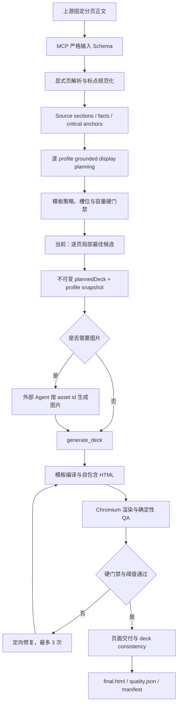

# PPT Generator MCP 架构与实现原理

本文描述 2026-07-30 主分支已经发布的生产行为。`docs/superpowers/` 下的设计与计划是演进依据；只有在状态明确变为 `Implemented` 且代码、测试和真实 MCP 验证一并合入后，才能视为公共功能。

## 1. 系统定位与边界

PPT Generator MCP 把上游已经分页的中文标书、技术方案或汇报正文，转换为经过逐页 QA 的自包含 A4 横向 HTML 展示页。它负责以下工作：

- 校验固定分页正文协议；
- 规范化中文标点并建立不可变来源证据；
- 抽取事实、关键锚点和页面元数据；
- 根据每个模板的严格能力 profile 规划可展示内容；
- 生成稳定的图片/图标意图和资产 ID；
- 接收外部生成的图片 data URL；
- 组装 HTML，并使用 Chromium 执行真实布局与质量门禁；
- 持久化计划、页面运行结果和整套一致性证据，支持幂等恢复。

系统不负责自动推测分页，也不要求最终产物必须是 `.pptx`。推荐交付物是自包含 `final.html`；截图 `final.png` 和质量 JSON 用于验收与追踪。

## 2. 总体数据流



模板知识沉淀是旁路流程：参考 HTML、截图或通用 blueprint 先经过安全检查和 owned compiler，再通过 Chromium QA，保存为不可变知识；它不会自动进入生产模板目录。

## 3. 固定正文如何变成来源证据

### 3.1 严格分页协议

高层 deck 路径只接受以下结构：

```text
<page 59>
一级标题：...
二级标题：...
三级标题：...
四级标题：可选
正文：
本页正文。
```

`<page N>` 必须独占一行，页码严格递增，调用参数 `pageNumbers` 必须与正文标记完全一致。高层路径不调用旧 Markdown 兼容解析器，不自动切页，也不会在缺少明确标记时猜测页码。入口实现位于 `src/services/explicit-page-parser.ts`。

### 3.2 中文标点规范化

`src/services/content-normalizer.ts` 和 `src/domain/chinese-punctuation.ts` 在事实抽取前统一处理中文标点，主要解决：

- 重复分号，例如 `；；`；
- 分号与句号等冲突结尾，例如 `；。`；
- 列表或事实重新组合时机械追加分号；
- 引号、括号附近不合理的句末标点组合。

规范化发生在来源建模和后续文本组合的公共边界，不针对某一页、某句话或某个模板写特例。

### 3.3 事实与关键锚点

每页正文被转换为有序 `SourceSection[]` 和 `SourceFact[]`。事实 ID 在整套文档中保持稳定顺序；计划会同时持久化原始 section ID、fact ID、事实文本和覆盖证据。

`src/domain/critical-anchor.ts` 识别不能在压缩表达中丢失的内容，包括数字、比例、日期、范围、单位、否定关系和其他决定事实含义的短语。grounded planner 可以合并表达，但每个事实必须恰好被表示，关键锚点必须出现在最终可见文本中。

## 4. `plan_deck` 的当前实现

### 4.1 页面元数据

显式标题被映射为页眉、章节、主题和小节元数据。每个字段在进入模板规划前就按展示容量校验；超长标题会返回可修复错误，而不是在渲染时缩到不可读字号。

### 4.2 每个模板都独立证明可行

对身份过滤后允许参与的每个 approved profile，`src/workflow/plan-deck.ts` 依次执行：

1. `planGroundedDisplay`：在该 profile 的真实容量预算内建立 display items；
2. `selectTemplate`：验证页面意图、密度、文档类型、图片基数和模板能力；
3. `solveTemplateSlots`：把每个 display item 分配到确定的语义槽位和 value index；
4. `materializeSlideSpec`：把已落地的 display plan 投影为确定性的 slide spec；
5. 校验页面元数据和图片提示词绑定的字符容量；
6. 只有 `unmatched=[]` 且 `unrepresentedFactIds=[]` 的候选才算成功。

失败候选只产生有界、脱敏的本地诊断，不会把依赖异常、堆栈、物理路径或隐藏提示词暴露给调用方。

### 4.3 当前模板选择顺序

当前主分支对每页独立排序全部成功候选：

1. 保留的正文字符数更多；
2. 模板选择分更高；
3. 内容块数量更接近模板 block capacity；
4. profile version 字典序稳定比较。

排序第一的候选成为该页模板。这一选择完全确定、可复现，但目前不会为整套页面的版式节奏牺牲任何页的局部最优，因此多页可能重复同一模板。

### 4.4 不可变计划证据

每个 slide plan 不只保存模板 slug，还保存：

- 原始 source sections、facts 和 fact 顺序；
- display plan、fact coverage 与关键锚点；
- deterministic slide spec 与图片意图；
- 完整 template profile snapshot 及 capability hash；
- 每个语义项的 slot assignment、字符使用和容量总计；
- 页面元数据与图片提示词的绑定证据；
- 候选评分、选择原因、文档策略和主题信息。

`planFingerprint` 绑定来源、页面顺序、质量要求和上述模板能力证据。使用相同 `requestId` 恢复计划时，Server 返回原计划，并用当前 catalog 再次校验 capability；不会静默重规划旧计划。

## 5. 模板 profile 为什么是核心

HTML 只描述“怎么画”，profile 描述“能否诚实地画”。`templates/green-infographic/template-profiles.json` 是生产模板能力的唯一事实来源，声明：

- `pageIntents` 与 `supportedRoles`；
- 语义槽位、必需槽位、每槽 item capacity 和字符上限；
- 标题、正文、表格、流程和辅助组件的 binding expansion；
- 图片占位符数量、`minAssets/maxAssets` 和无图处理策略；
- block capacity、密度区间、最小正文字号和最大位图面积；
- 标书、方案、展示等文档类型兼容性；
- A4 横向格式、设计 token 和必须存在的页面地标。

模板选择不能绕过 profile。新增 HTML 而不新增准确 profile，或扩大 HTML 容量却不更新 profile，都会导致规划证据和真实渲染不一致。

## 6. 图片与外部 Agent 的职责分界

`plan_deck` 返回的 `assets` 是确定性图片意图，每项包含稳定、页级作用域的 ID 和 prompt。高层 workflow 不在规划阶段调用图片 API。

调用方可以使用任意图像能力生成图片，但必须：

1. 保留 Server 返回的资产 ID；
2. 转换为允许的 PNG、JPEG、WebP 或 SVG data URL；
3. 通过 `externalAssets` 交给 `generate_deck`；
4. 不添加计划之外的资产，也不把远程 URL 当成交付图片。

若缺少必需图片，`generate_deck` 返回 `needs_assets`。补齐后复用相同 request ID 即可继续，已经交付的页面不会重复生成。只有最终被选页面的资产会出现在高层规划输出中。

## 7. `generate_deck`、逐页 QA 与修复

### 7.1 生成前验证

`generate_deck` 先读取不可变计划并验证：

- deck plan ID、request ID 和输入 schema；
- 当前模板 catalog 与持久化 profile snapshot 一致；
- 外部资产 ID、类型、数量、大小和 data URL 安全；
- 每页只消费属于该页的资产；
- 同一 request ID 的并发请求按队列串行化。

### 7.2 HTML 组装

内容映射不做自由字符串替换，而是依据持久化 assignment、profile bindings 和模板占位符进行确定性投影。最终 HTML 必须自包含，不允许脚本、远程字体、远程图片、Logo 或水印。

### 7.3 Chromium 硬门禁

`src/services/page-renderer.ts` 在真实 Chromium 中测量 DOM、字体、图片和布局；`src/services/deterministic-evaluator.ts` 至少检查：

- 画布和 body 无滚动溢出；
- 元素未越界、未被祖先裁剪、未发生非豁免碰撞；
- 正文字号不低于 profile 与文档策略中更严格的值；
- 普通文本与大字满足相应对比度；
- 位图数量和面积不超过更严格的模板/文档上限；
- 图片为允许的内联格式，能够加载且不是空白占位；
- 页面元数据、语义项、fact ID、关键锚点和可见文本与计划一致；
- 必需语义槽、地标和图片槽均满足 profile。

可选多模态 reviewer 只能补充质量判断，不能覆盖确定性硬门禁。诊断在返回前还会经过安全规范化，避免泄露路径、提示词或敏感内容。

### 7.4 定向修复

失败页面进入有界质量循环，默认最多 3 次。修复路由只允许执行计划支持的动作，例如调整字号/间距 token、增强对比度、在兼容范围内切换模板或重新生成已声明资产。每次尝试都有独立 HTML、截图和质量证据。

仅当页面分数达到阈值且全部硬门禁通过时，页面才可交付。整套页面完成后还要执行 deck consistency；任何失败页或跨页一致性问题都会使结果保持 `partial`，不能作为正式交付。

## 8. 状态、幂等与恢复

### 8.1 计划阶段

`DeckStore.createOrResumePlan` 使用 request ID 与 canonical input 建立不可变计划身份：

- 同一 request ID + 相同输入：返回原计划；
- 同一 request ID + 不同输入：拒绝复用；
- 恢复时 catalog 能力不再匹配：拒绝继续，避免用新模板解释旧证据。

### 8.2 生成阶段

deck run 按页持久化状态。重复调用会复用已完成页，只处理缺失资产或尚未交付的页面。最终状态语义：

| 状态 | 含义 |
|---|---|
| `needs_assets` | 计划要求的图片尚未全部提供，可恢复 |
| `running` | 页面正在生成或 QA |
| `partial` | 有失败页或 deck consistency 问题，不可交付 |
| `delivered` | 所有页面和整套一致性检查均通过 |
| `failed` | 未形成可安全继续的结果 |

## 9. MCP 工具面

Server 当前注册 20 个工具，分为四层。

### 9.1 推荐的多页交付工具

| 工具 | 责任 |
|---|---|
| `plan_deck` | 固定分页正文到不可变计划、模板证据和图片 prompts |
| `generate_deck` | 外部资产注入、逐页生成、QA、修复和一致性检查 |
| `get_deck` | 按 UUID 读取脱敏计划、manifest 或白名单产物 |

### 9.2 模板知识工具

| 工具 | 责任 |
|---|---|
| `inspect_template` | 只读检查有界内联 HTML，提取通用布局知识 |
| `create_template_from_reference` | 从一种参考输入编译并 QA 不可变模板知识 |
| `list_template_knowledge` | 列出已批准知识、能力标签和 QA 证据 |

### 9.3 单页兼容与诊断工具

`plan_slide`、`generate_slide`、`get_run`、`get_artifact`、`evaluate_slide` 保留给旧 workflow、单页调试和自定义编排。新的稳定多页交付应优先使用 deck 工具。

### 9.4 原子模板工具

`list_templates`、`load_template`、`fill_placeholders`、`insert_asset_slots`、`render_icons`、`assemble_page`、`validate_page`、`parse_source_content`、`generate_image` 用于受控的低层编排。

高层 deck 工具不接受 API Key、任意文件路径或远程图片 URL。低层 `generate_image` 只有在 Server 配置 provider 时才可用，不改变高层“外部资产注入”的推荐边界。

## 10. 模板知识沉淀

模板学习的目标是复用网格、层级、间距、色板、组件和视觉比例，而不是复制参考页面正文或品牌。

1. `inspect_template` 对内联 HTML 做只读安全检查并输出归一化 blueprint；
2. `create_template_from_reference` 每次只接受一种输入：内联 HTML、受限图片 data URL 或已验证 blueprint；
3. 截图缺少 Server 视觉分析器时返回 `needs_analysis`，由外部 Agent 填充通用 blueprint；
4. owned compiler 生成 Server 自有的模板结构，不把截图当背景，也不保留可见正文、Logo、水印或品牌；
5. 模板目录校验和真实 Chromium QA 通过后，知识以版本化记录写入 store；
6. 人工检查后把闭集产物晋升到 `templates/`，重启 Server 才参与生产选择。

这条隔离线避免未经验证的参考页面直接影响正式交付。

## 11. 安全设计

- 所有工具入口使用 strict Zod schema，拒绝未知字段；
- provider 密钥只从环境变量读取，并以不可枚举属性保存在 Server 内部；
- 高层工具只接受逻辑 ID、正文和 data URL，不接受调用方物理路径；
- store 对路径做根目录包含、realpath 和符号链接检查；
- 可读取产物使用固定白名单和大小上限，大型 HTML 不通过公共文本接口回传；
- 图片大小、数量、输入字符数、并发数和请求时长都有上限；
- 外部下载仅在明确配置的低层 provider 场景使用 host allowlist；
- MCP 错误统一转为结构化、安全诊断，未知异常不把原始消息或堆栈返回调用方。

## 12. 当前限制与演进方向

### 12.1 当前限制

- 上游必须先分页；Server 不做语义自动分页；
- 当前模板目录只有 `green-infographic` 模板族；
- 当前 `plan_deck` 逐页选择局部最佳候选，可能连续使用同一版式；
- 只有经过 profile、文档策略和 grounded planner 全部验证的模板才有资格参与选择，因此模板数量多不等于某页存在多个合格候选；
- 高层 workflow 不隐式调用图片 API；调用方必须完成图片生成和注入；
- 主分支当前只有 typecheck/build 检查脚本，后续功能实施计划中新增的测试命令尚未发布。

### 12.2 已批准的整套模板多样性设计

下一阶段会先保留每页全部合格候选，再用有界、确定性的序列优化器选择整套组合。事实覆盖、critical anchors、容量、字号、图片基数和文档策略仍是硬门禁；只有质量接近本页最佳的候选才能参与多样性竞争。

这不是强化学习。它没有训练数据、探索、策略更新或环境奖励，只使用固定质量带、固定效用函数和确定性 tie-breaker 求解组合优化问题。完整设计见 `docs/superpowers/specs/2026-07-30-deck-template-diversity-design.md`。

## 13. 扩展时的验收清单

### 新模板

- HTML 自包含、A4 横向、slug 唯一；
- profile 准确声明所有容量、角色、图片槽和文档兼容性；
- template bindings 与 profile expansion 完全一致；
- 不依靠缩小到不可读字号容纳正文；
- 真实 Chromium 检查地标、溢出、碰撞、字号、对比度和图片；
- 对同一正文重复规划得到同一计划和 fingerprint。

### 新 workflow 能力

- 先定义输入、持久化证据和历史兼容策略；
- 新策略不能绕过事实、容量、图片或文档硬门禁；
- 外部 provider 必须可选，并保持密钥只在 Server 环境；
- 幂等恢复不能因新默认值改变历史计划身份；
- 更新 README、本文和真实 MCP 验收步骤后再进入主分支。
