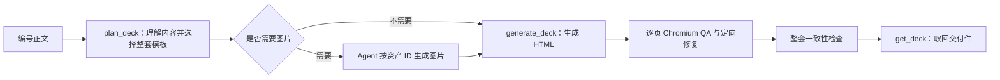

# PPT Generator MCP 非技术用户指南

这份指南面向标书编制、方案策划、咨询顾问和 Agent workflow 使用者。您不需要会写程序；只要能准备好已经分页的正文，就可以让支持 MCP 的 Agent 完成模板选择、图片需求整理、HTML 生成和逐页质量检查。

如果只想尽快跑通一次，请从[路径 A：已有支持 MCP 的 Agent](#路径-a已有支持-mcp-的-agent)开始。项目维护者可直接阅读[架构与实现原理](architecture.md)。

## 1. 最终能得到什么

输入是按页编号的中文正文，输出是每页一个可独立打开的 A4 横向 `final.html`，并附带：

- 本页选用了哪个模板，以及选择原因；
- 本页需要的图片及对应提示词；
- Chromium 真实排版检查结果；
- 字号、溢出、碰撞、对比度、图片和事实覆盖等逐页 QA；
- 整套页面的一致性检查结果；
- 可恢复的计划和运行记录。

最终交付件不要求是 `.pptx`。`final.html` 已内联 CSS、SVG 和图片，可用浏览器直接打开，也便于后续截图、打印或转成其他格式。

先认识五个词：

| 名称 | 通俗解释 |
|---|---|
| 正文 | 上游已经按 `<page N>` 分好的原始内容 |
| 模板 | 页面布局、字号、容量、图片槽和适用场景的可执行规则 |
| 素材 | 模板需要的图片或图标，由外部 Agent 按稳定 ID 提供 |
| 计划 | MCP 固化的正文事实、页面内容和模板选择；生成时不能偷偷更换 |
| 交付件 | 通过逐页 QA 的 `final.html`、质量报告和整套检查结果 |

## 2. 选择您的起点

### 路径 A：已有支持 MCP 的 Agent

如果团队已经安装并连接了 `ppt-generator`，您只需要准备正文，然后把下面这段话和正文一起发给 Agent：

```text
请使用 ppt-generator MCP，把我提供的编号正文生成正式标书风格的 HTML 展示页。

要求：
1. 校验每个 <page N> 是否独占一行，并让 pageNumbers 与正文页码完全一致；不要自动分页。
2. 使用 plan_deck，documentType 设为 bid，templateDiversity 设为 balanced。
3. 保留原文事实、数字、比例、日期、范围、否定关系和责任关系。
4. 如果 plan_deck 返回 assets，只按返回的资产 ID 和 prompt 生成图片；没有图片 API 时，使用当前 Agent 自带的图片生成能力。
5. 把生成图片转换为受支持的 image data URL，保持原资产 ID，调用 generate_deck。
6. 如果返回 needs_assets，补齐缺失素材并复用同一个 requestId 继续，不要重建计划。
7. 逐页查看 QA 和整套 consistency；只有 deck status=delivered 且每页 status=delivered 才作为正式交付。
8. 使用 get_deck 取回每页 final.html、quality.json，以及整套 consistency.json，并汇报模板选择、QA 分数和交付结果。

下面是正文：
[把完整编号正文粘贴在这里]
```

如果 Agent 的工具列表中看不到 `plan_deck`，说明 MCP 还没有连接成功，请转到[路径 B](#路径-b从零安装和启动)。

### 路径 B：从零安装和启动

#### 第一步：确认 Node.js

需要 Node.js 22 或更高版本。在终端运行：

```bash
node -v
```

如果显示 `v22`、`v23` 或更高版本，可以继续。如果没有安装，请先从 [Node.js 官方网站](https://nodejs.org/)安装当前 LTS 版本。

#### 第二步：下载并构建项目

还没有项目目录时运行：

```bash
git clone https://github.com/SUSTechWLA/ppt-generator-mcp.git
cd ppt-generator-mcp
npm install
npx playwright install chromium
npm run check
```

已经下载项目时，从 `cd` 对应的项目目录开始执行即可。`npm run check` 成功表示类型检查和生产构建已经完成，MCP 启动文件位于 `dist/src/server.js`。

#### 第三步：连接 MCP 客户端

把下面配置加入 Agent 或 MCP 客户端的 Server 配置，并把 `cwd` 改成项目的真实绝对路径：

```json
{
  "mcpServers": {
    "ppt-generator": {
      "command": "node",
      "args": ["dist/src/server.js"],
      "cwd": "/您的绝对路径/ppt-generator-mcp"
    }
  }
}
```

如果客户端明确支持 `${workspaceFolder}`，也可以直接使用项目自带的 [.mcp.json](../.mcp.json)。保存后重启 MCP 客户端或重新载入 Server。

连接成功的最简单判断是：Agent 可以看到 `plan_deck`、`generate_deck` 和 `get_deck`。

#### 第四步：让 Agent 执行

回到[路径 A 的可复制提示词](#路径-a已有支持-mcp-的-agent)，粘贴正文并执行。正常使用不需要手工运行 `npm start`；MCP 客户端会按照上面的 stdio 配置启动服务。只有独立检查启动时才运行：

```bash
npm start
```

## 3. 正文必须怎样准备

这个 MCP 只处理上游已经分页的正文，不自动决定哪里换页。每页必须满足：

1. `<page N>` 独占一行；
2. 页码为正整数并严格递增；
3. 至少有一个 `一级标题：`、`二级标题：`、`三级标题：` 或 `四级标题：`；
4. 标题写在 `正文：` 之前；
5. `正文：` 之后必须有实际内容；
6. 调用 `plan_deck` 时的 `pageNumbers` 与标记完全一致。

推荐格式：

```text
<page 59>
一级标题：第一分节：优势与有利条件分析
二级标题：2.1 项目需求深度理解
三级标题：2.1.1 项目背景与采购需求解读
正文：
项目服务覆盖三个业务区域，要求在合同生效后30日内完成首轮建档。
项目团队须建立7×24小时响应机制，并按月提交质量分析报告。

<page 60>
一级标题：第一分节：优势与有利条件分析
二级标题：2.2 服务方案
三级标题：2.2.1 实施路径
正文：
实施过程分为启动准备、全面执行、持续优化三个阶段。
每个阶段均设置责任人、交付物和验收标准。
```

这里的 59、60 只是上游文档页码示例，不是模板规则。换成 1、2 或 101、102，模板选择逻辑仍然只看正文语义和模板能力。

常见格式错误：

```text
错误：请见 <page 59> 的内容       # 页码标记没有独占一行
错误：<page 60> 后又出现 <page 59> # 页码没有递增
错误：正文写完后再放三级标题       # 标题必须在 正文： 之前
错误：pageNumbers=[59,61]          # 与实际 59、60 不一致
```

正文中的 `；；`、`；。` 等重复或冲突标点会在公共内容边界被规范化，但这不等于改写事实。数字、比例、日期、范围、否定关系和责任关系仍按来源证据保留。

## 4. 一次完整生产流程



### 第一步：规划页面

Agent 调用 `plan_deck`。典型参数如下：

```json
{
  "sourceText": "<page 59>\n一级标题：第一分节\n二级标题：2.1 服务理解\n三级标题：2.1.1 采购需求解读\n正文：\n这里是已经分页的事实正文。",
  "pageNumbers": [59],
  "documentType": "bid",
  "templateDiversity": "balanced",
  "audience": "招标评审专家与项目业主",
  "quality": {
    "minScore": 90,
    "maxAttempts": 3
  },
  "requestId": "proposal-plan-20260731"
}
```

返回结果中最重要的是：

- `deckPlanId`：后续生成必须使用的计划 ID；
- `plannedDeck.slides`：每页内容、模板和选择证据；
- `assets`：最终被选页面真正需要的图片 ID、提示词和尺寸意图；
- `nextStep`：下一步是补图片还是直接生成。

计划一旦建立就不可变。相同 `requestId` 用于恢复同一次规划，不能用它悄悄替换正文。

### 第二步：补齐图片素材

如果 `assets` 为空，直接进入第三步。

如果存在素材，Agent 必须遵守两条规则：

1. 只生成返回结果中的资产 ID，不自行增加或改名；
2. 图片内容必须符合对应 prompt 的业务语义，不能用无关装饰图代替。

没有文生图 API 也可以工作：让 Agent 使用当前可用的图片生成能力，生成 PNG、JPEG、WebP 或 SVG，再转换为 base64 image data URL。MCP 本身不会在规划阶段自动调用图片服务，也不会接收调用方 API Key。

如果当前 Agent 完全没有图片能力，应停在这里并报告缺少哪些资产，不要伪造 data URL 或换用不匹配的模板。

### 第三步：生成并逐页 QA

Agent 使用计划 ID 和素材调用 `generate_deck`：

```json
{
  "deckPlanId": "plan_deck 返回的 UUID",
  "externalAssets": [
    {
      "id": "p59-img-001",
      "dataUrl": "data:image/png;base64,真实图片的Base64内容"
    }
  ],
  "requestId": "proposal-run-20260731"
}
```

没有素材需求时，`externalAssets` 传空数组。每页会独立执行 Chromium QA，并在需要时进行最多三轮定向修复；某一页失败不会被总分掩盖。

### 第四步：读取交付件

`generate_deck` 返回每页的 `runId` 和 artifact 引用。让 Agent 按引用调用 `get_deck`：

```json
{
  "id": "某一页的 runId",
  "view": "artifact",
  "artifact": "final.html"
}
```

同一个页面还可以读取 `quality.json` 和 `manifest.json`。整套运行使用 `deckRunId` 读取 manifest 或 `consistency.json`：

```json
{
  "id": "整套 deckRunId",
  "view": "artifact",
  "artifact": "consistency.json"
}
```

在本机默认配置下，页面文件也保存在 `output/runs/<runId>/`。高层 MCP 接口只按 UUID 和白名单产物名读取，不接受任意文件路径。

## 5. 模板多样性怎样选择

通常保持默认 `balanced` 即可。

| 模式 | 适合场景 | 实际行为 |
|---|---|---|
| `off` | 必须保持每页各自的局部最优 | 不从整套角度调整版式 |
| `conservative` | 正式标书、版式变化要非常克制 | 只在几乎相同质量的候选中减少重复 |
| `balanced` | 大多数标书、方案和汇报 | 在窄质量范围内兼顾单页质量和整套节奏，默认推荐 |
| `expressive` | 更强调视觉变化的展示 | 允许更宽但仍受限的近最佳候选参与整套选择 |

模板选择分两步：

1. 先淘汰不合格候选。事实放不下、字号不达标、图片槽不匹配、文档类型不支持的模板都不能参加；
2. 再从接近本页最佳质量的候选中，为整套页面选择组合，奖励不同版式，惩罚连续重复。

因此，多样性不是“每页必须不同”。如果某页只有一个能够完整承载正文的模板，重复它反而是正确结果。该选择器也不是强化学习：它没有训练、探索或线上奖励更新；相同正文、模板目录和参数会得到相同结果。

如果显式传入 `templateSlug`，表示强制整套使用指定模板，此时多样性模式等效为 `off`。普通用户不建议强制模板，除非已经确认每一页都符合该模板容量。

## 6. 如何判断是否可以交付

整套状态：

| 状态 | 含义 | 应该怎么做 |
|---|---|---|
| `needs_assets` | 仍缺少计划要求的图片 | 按 `missingAssetIds` 补齐，并复用同一生成 `requestId` |
| `running` | 正在生成或恢复 | 等待 Agent 完成后再次读取 manifest |
| `partial` | 有失败页或整套一致性问题 | 查看失败页 QA 和 consistency，不要交付 |
| `delivered` | 所有页面和整套检查均通过 | 可以收集各页 `final.html` 正式交付 |
| `failed` | 没有形成可继续的安全结果 | 按返回的错误和 recovery 修正文档或配置后重新规划 |

页面状态还可能出现 `best_effort`。它表示页面有可查看结果，但没有完全达到正式交付标准；整套通常会是 `partial`，不能当作已交付。

建议让 Agent 最终给出一张验收表：

```text
页码 | 模板 | 页面状态 | QA 分数 | 硬门禁 | HTML | 备注
59   | ...  | delivered | ...   | 通过     | 已取回 | ...
60   | ...  | delivered | ...   | 通过     | 已取回 | ...

整套状态：delivered
一致性检查：通过
```

## 7. 基本原理：为什么结果更稳定

### 先锁定事实，再考虑页面美观

系统先把正文拆成来源段落、事实和关键锚点。模板只能压缩表达，不能丢失决定含义的数字、日期、范围、否定词和责任关系。

### 模板不只是好看的 HTML

每个可用模板都有能力档案，声明能放多少文字、支持哪些语义结构、是否需要图片、最低字号和适用文档类型。MCP 根据这些能力做匹配，而不是根据模板文件名猜测。

### 先做每页候选，再选择整套组合

每个模板必须先独立证明能够完整承载本页内容。只有接近本页最佳质量的成功候选，才参与整套版式组合；这能在不牺牲事实和可读性的前提下减少机械重复。

### 规划与生成分开

`plan_deck` 固化内容和模板决定，`generate_deck` 只按计划注入图片、生成和 QA。失败恢复时不会静默换模板，也不会让同一页前后版本失去依据。

### QA 是硬门禁，不是装饰分数

页面会在真实 Chromium 中检查尺寸、溢出、碰撞、字号、对比度、图片加载和事实映射。硬门禁失败时，即使总分看起来不低，也不会成为 `delivered`。

更详细的数据结构、选择阈值、恢复机制和安全边界见[架构与实现原理](architecture.md)。

## 8. 从优秀页面沉淀模板知识

除了生成页面，MCP 还可以借鉴优秀 HTML、展示页截图或通用蓝图，沉淀可复用的网格、层级、色板、间距和组件比例。

推荐流程：

1. 对内联参考 HTML 调用 `inspect_template`，只读检查布局和安全风险；
2. 调用 `create_template_from_reference`，每次只提供一种来源：HTML、受限图片 data URL 或合规 blueprint；
3. 截图在没有视觉分析器时会返回 `needs_analysis`，Agent 应按 `analysisPrompt` 生成通用 blueprint 后重新提交；
4. 只有经过目录校验和真实 Chromium QA 的结果才会成为 `approved` 模板知识；
5. 使用 `list_template_knowledge` 查看已经批准的知识记录；
6. 新知识需要人工晋升到生产模板目录，重启 Server 后才参与正式选择。

这个过程学习的是布局方法，不是复制参考页正文、Logo、水印、品牌或整张截图。

## 9. 常见问题

### Agent 看不到 MCP 工具

- 确认 `npm run check` 已成功；
- 确认 MCP 配置中的 `cwd` 是项目绝对路径；
- 确认启动命令是 `node dist/src/server.js`；
- 保存配置后重启客户端；
- 查看客户端的 MCP Server 日志，而不是把日志混入正文。

### 返回页码或正文格式错误

- 检查 `<page N>` 是否独占一行；
- 检查 `pageNumbers` 是否与正文完全一致并严格递增；
- 确认至少有一个受支持标题；
- 确认每页只有一个 `正文：`，且正文不为空。

### 每页还是用了同一个模板

先看 `plannedDeck.slides[].templateMatch.selectionReason`。如果每页只有一个通过硬门禁的候选，重复是质量约束的结果，不是多样性失效。只有多个候选接近本页最佳质量时，`balanced` 才会为整套节奏选择不同版式。

### 一直返回 `needs_assets`

- 按 `missingAssetIds` 逐一核对；
- 资产 ID 必须与计划完全相同；
- `dataUrl` 必须是真实 base64 图片，支持 PNG、JPEG、WebP 或 SVG；
- 复用原来的生成 `requestId`，不要另建计划。

### 有 HTML，但状态是 `partial` 或页面是 `best_effort`

这只是可诊断结果，不是正式交付。读取失败页的 `quality.json` 和整套 `consistency.json`，根据溢出、字号、图片、事实覆盖或一致性问题修复来源或模板能力后重新运行。

### 没有任何大模型或图片 API 能否运行

可以完成确定性正文规划、模板选择、HTML 生成和 Chromium QA。只有当最终模板确实需要图片时，必须由外部 Agent 提供对应素材；否则流程会安全地停在 `needs_assets`。

## 10. 普通工具与高级工具的边界

普通 workflow 只需要下面六个高层工具：

| 工具 | 用途 |
|---|---|
| `plan_deck` | 编号正文变成不可变页面计划、模板证据和图片提示词 |
| `generate_deck` | 注入外部图片，生成页面并执行逐页 QA |
| `get_deck` | 按 UUID 读取计划、manifest 和白名单产物 |
| `inspect_template` | 只读分析参考 HTML 的通用布局知识 |
| `create_template_from_reference` | 从 HTML、截图或 blueprint 编译并 QA 模板知识 |
| `list_template_knowledge` | 查看已批准的模板知识与 QA 证据 |

`plan_slide`、`generate_slide`、`generate_image` 和原子模板工具主要用于兼容、诊断或受控开发。部分高级工具可以接收物理路径、输出目录、远程地址或调用方 provider 配置，并继承宿主进程的文件和网络权限；不要把它们直接开放给不可信 Agent。

生产部署建议只放行实际需要的六个高层工具。完整信任边界见[架构文档的 MCP 工具面](architecture.md#9-mcp-工具面)和[安全设计](architecture.md#11-安全设计)。

## 11. 下一步

- 第一次运行：使用[路径 A 的提示词](#路径-a已有支持-mcp-的-agent)完成一到两页验证；
- 正式生产：提交完整编号正文，保持 `balanced`，逐页验收后再交付；
- 维护模板：阅读 [green-infographic 模板说明](../templates/green-infographic/README.md)；
- 开发 workflow 或扩展 MCP：阅读[架构与实现原理](architecture.md)。
